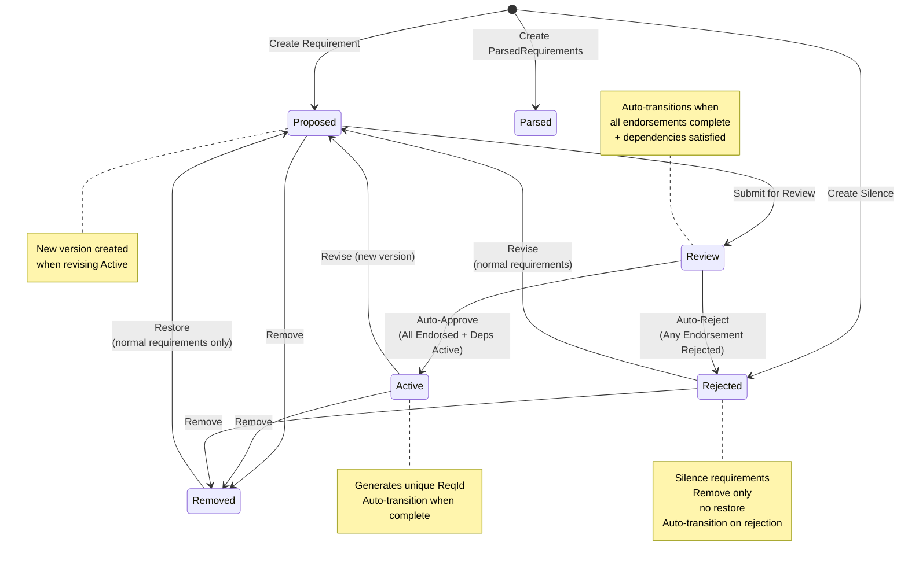

## Getting Started

### Prerequisites

- [VS Code](https://code.visualstudio.com/)
  - `choco install vscode`
- WSL2
  - [WSL2 Installation Guide](https://docs.microsoft.com/en-us/windows/wsl/install)
- [Docker Desktop](https://www.docker.com/products/docker-desktop/)
  - `choco install docker-desktop`

## Project Setup

1. Update your local machine hosts file to include the following entry:

```
127.0.0.1 cathedral.local
```

2. Start Docker Desktop.
3. Open the project in VS Code.
4. The project should automatically detect the `.devcontainer` folder and ask you to reopen the project in a container. You'll need the `.env.keys` file with the decryption key from your team (not committed to git).
5. Reopen the project in the dev container. (You can also do this by clicking on the blue button in the bottom left corner of the window.)
6. The project will now start downloading the necessary dependencies and setting up the environment.
  1. Docker images
  2. Node modules
  3. VS Code extensions
7. Once setup is complete, next you need to initialize the database. Run the following commands in the terminal:

```bash
npm run orm-create-db:local
npm run orm-run-pending-migrations:local
```

### Environment Variables

This project uses [dotenvx](https://dotenvx.com) for encrypted environment variable management.

- The `.env.local` file is encrypted and committed to version control.
- The `.env.keys` file contains the private decryption keys and is **not** committed.
- All npm scripts automatically decrypt and load environment variables at runtime using dotenvx.

To update environment variables:
- Use `npm run dotenvx:set KEY "value" -f .env.local` to encrypt a value.
- To edit manually, run `npm run dotenvx:decrypt:local`, make your changes, then run `npm run dotenvx:encrypt:local` to re-encrypt.
## Production Deployment

For first-time production deployment, set `DOTENV_PRIVATE_KEY_PRODUCTION` in Azure Portal (app-cathedral → Configuration → Application Settings) using the value from your local `.env.keys` file. This is needed once to decrypt the encrypted `.env.production` file in the Docker container. Deploy by creating a release tag in GitHub (e.g., `v0.1.0`).

## Database population

There are a number of commands defined in `package.json` that can be run to populate the database with data:

1. `npm run orm-create-db`
2. `npm run orm-run-pending-migrations`
3. `npm run orm-seed-users`

## Running the project

The project can be run in debug mode via: `npm run dev`. You can then access the application at `https://cathedral.local`.

A production build can be run via: `npm run build` followed by `npm run preview`. You can then access the application at `https://cathedral.local`.

## Data model

The database is in Version Normal Form to support temporal data. More details available [here](https://github.com/final-hill/cathedral/issues/435).

## Requirements Domain Inheritance Hierarchy

The Cathedral system implements a comprehensive inheritance hierarchy for requirement entities based on requirements framework literature. Understanding this hierarchy is crucial for developers working with the domain model.

### Complete Inheritance Tree

```
Requirement
│
├── Goal
│   ├── ContextAndObjective (G.1.#)
│   ├── Obstacle (G.2.#)
│   └── Outcome (G.3.#)
│
├── Behavior
│   ├── Example
│   │   ├── Epic (G.5.#)
│   │   ├── UseCase (S.4.2.#) <: Prioritizable
│   │   ├── UserStory (S.4.1.#) <: Prioritizable
│   │   ├── TestCase (S.6.#)
│   │   └── ScenarioStep
│   └── Functionality
│       ├── FunctionalityOverview (G.4.#)
│       ├── FunctionalBehavior (S.2.1.#) <: Prioritizable
│       └── NonFunctionalBehavior (S.2.2.#) <: Prioritizable
│
├── Interface (S.3.#) <: Prioritizable
│
├── InterfaceArtifact
│   ├── InterfaceOperation
│   ├── InterfaceInput
│   ├── InterfaceOutput
│   ├── InterfaceDataType
│   └── InterfaceFlow
│
├── Actor
│   ├── Person (P.1.#)
│   └── Component
│       ├── EnvironmentComponent (E.2.#)
│       ├── SystemComponent (S.1.#)
│       ├── GlossaryTerm (E.1.#)
│       └── Stakeholder (G.7.#)
│
├── Responsibility
│
├── MetaRequirement
│   ├── ParsedRequirements (P.7.#)
│   ├── Justification
│   ├── Goals
│   ├── Project
│   ├── System
│   ├── Solution
│   ├── Environment
│   └── Organization
│
├── Task
├── Constraint (E.3.#)
├── Invariant (E.6.#)
├── Effect (E.5.#)
├── Assumption (E.4.#)
├── Limit (G.6.#)
├── Silence
├── Product (P.2.#)
└── Noise
    └── Hint
```

### ORM Implementation

The inheritance hierarchy is implemented in the ORM using Single Table Inheritance with discriminator fields. This allows:
- Querying parent types returns all subtypes automatically
- Efficient database operations across the entire hierarchy
- Type-safe domain model with proper inheritance relationships

## Application Architecture

The application is a [monolith](https://martinfowler.com/bliki/MonolithFirst.html) following a layered architecture. The application is split into the following layers:

### Server

- domain
   - Entities & Value Objects
- data
   - models (used by MikroORM)
- api
   - This is currently blending the application and infrastructure layers. This will be refactored in the future by separating the application and infrastructure layers.

### Client

- pages
- components
- layouts

## CI/CD Notes

The Infrastructure is managed by Azure Bicep. The CI/CD pipeline is managed by GitHub Actions.
Communication between GitHub and Azure is managed by OpenID Connect.

- [Configuration details](https://learn.microsoft.com/en-us/azure/azure-resource-manager/bicep/deploy-github-actions?tabs=CLI%2Copenid)
  - [Supporting details](https://learn.microsoft.com/en-us/azure/developer/github/connect-from-azure?tabs=azure-cli%2Cwindows#use-the-azure-login-action-with-openid-connect)
- [GitHub Environment details](https://docs.github.com/en/actions/administering-github-actions/managing-environments-for-deployment)

## Slackbot testing

Create an ngrok tunnel to the local server:

```bash
ngrok http https://localhost:3000
```

Update the Slackbot configuration (Event Subscriptions) to point to the generated ngrok tunnel.

`https://<ngrok-url>/api/slack`

Note that this will only work if the server is running locally (`npm run dev`).

Once the local server is stopped, the ngrok tunnel will be closed and the Slackbot will no longer work.

## Solution Initialization and Personnel Management

### Automatic Solution Setup

When a Solution is created, Cathedral automatically initializes the project with essential personnel to eliminate bootstrapping challenges:

#### Automatic Personnel Creation
1. **Solution Creator Person**: A Person entity is automatically created for the solution creator with comprehensive role capabilities
2. **AppUser-Person Linking**: The Solution Creator Person is linked to the solution creator's AppUser
3. **Role Capabilities**: The Solution Creator Person is automatically granted both Product Owner and Implementation Owner capabilities
4. **Active Workflow State**: The Solution Creator Person is created in the `Active` workflow state
5. **Endorsement Capability**: This ensures endorsers exist from the moment the Solution is created

#### Person Role Capabilities
The Solution Creator Person is automatically configured with:
- **isProductOwner: true** - Full Product Owner capabilities and permissions
- **isImplementationOwner: true** - Full Implementation Owner capabilities and permissions
- **All Endorsement Permissions** - Can endorse all requirement categories

#### Initial Requirements Summary
For each new Solution, the following requirements are automatically created:
- **One Solution Creator Person** (in `Active` state, linked to solution creator's AppUser with both Product Owner and Implementation Owner capabilities)
- **One Context and Objective** (in `Proposed` state, providing a template for defining the solution's purpose and scope). This is a singleton requirement type and cannot be removed once it reaches `Active` state.

### Person-Based Endorsement Permissions

Cathedral implements granular endorsement permissions to control which persons can endorse different requirement categories:

#### Endorsement Permission Flags
- **canEndorseProjectRequirements**: Can endorse requirements under the Project category
- **canEndorseEnvironmentRequirements**: Can endorse requirements under the Environment category
- **canEndorseGoalsRequirements**: Can endorse requirements under the Goals category
- **canEndorseSystemRequirements**: Can endorse requirements under the System category

#### Special Role Capabilities
- **Product Owner** (`isProductOwner: true`): Automatically has all endorsement permissions
- **Implementation Owner** (`isImplementationOwner: true`): Automatically has all endorsement permissions
- **UI Behavior**: The `isProductOwner` and `isImplementationOwner` flags are not directly editable in the UI

### Person Protection Rules

#### Mandatory Capability Protection
1. **Deletion Prevention**: Persons with Product Owner or Implementation Owner capabilities cannot be removed
2. **Capability Preservation**: System ensures at least one person with each mandatory capability exists
3. **Validation**: System prevents removing persons who are the sole holders of mandatory capabilities

#### AppUser-Person Synchronization
- **Deactivation Handling**: When an AppUser is deactivated, corresponding Person entities are updated
- **Capability Continuity**: System ensures mandatory capabilities are maintained during personnel changes

## Requirements Workflow

The Cathedral application implements a comprehensive workflow system for managing requirements throughout their lifecycle. This workflow ensures quality control, proper review processes, and maintains traceability of all requirement changes.

### Workflow States

Requirements in Cathedral follow a five-state workflow:

#### 1. **Proposed**
- **Purpose**: Initial state for newly created requirements
- **Description**: Requirements that have been submitted but not yet reviewed or approved
- **Actions Available**:
  - **Edit**: Modify the requirement content while maintaining the Proposed state
  - **Submit for Review**: Move the requirement to the Review state
  - **Remove**: Move the requirement to the Removed state

#### 2. **Review** (also called "In Review")
- **Purpose**: Requirements undergoing evaluation for approval
- **Description**: Requirements that are being assessed for correctness, completeness, and alignment with project goals
- **Actions Available**:
  - **Review**: Open the review dialog to approve or reject the requirement
  - **Approve**: Move the requirement to the Active state and generate a unique `ReqId`
  - **Reject**: Move the requirement to the Rejected state

**Approval Validation**: Before a requirement can be approved and moved to Active state, all referenced requirements (such as Primary Actor, Outcome, etc.) must already be in the Active state. This ensures topological ordering and prevents broken references. If any referenced requirement is not Active, the approval will fail with a clear error message indicating which requirement needs to be approved first.

**Dropdown Behavior**: While editing requirements in Review state, dropdown menus will show requirements from all visible workflow states (Active, Proposed, Review) to allow flexibility during editing. However, the approval validation ensures data integrity at the time of activation.

#### 3. **Active**
- **Purpose**: Requirements that are officially part of the project
- **Description**: Requirements that have been approved and are currently in effect. Each Active requirement has a unique ReqId for tracking and reference
- **Actions Available**:
  - **Revise**: Create a new version in the Proposed state (original remains Active until the revision is approved)
    - **Restriction**: Cannot revise if there are newer versions already in Proposed or Review states to prevent conflicting parallel changes
  - **Remove**: Move the requirement to the Removed state

**Versioning Behavior**: When an Active requirement is revised, a new version is created in the Proposed state while the original Active version remains unchanged. This allows for parallel development where multiple proposed changes can exist simultaneously, each following independent review processes. However, to prevent conflicts, only one revision can be in progress at a time.

#### 4. **Rejected**
- **Purpose**: Requirements that were reviewed but not approved
- **Description**: Requirements that failed review and need revision before resubmission
- **Actions Available**:
  - **Revise**: Modify and move back to the Proposed state for another review cycle
  - **Remove**: Move the requirement to the Removed state

#### 5. **Removed**
- **Purpose**: Requirements that have been deleted from active consideration
- **Description**: Requirements that are no longer part of the project but are preserved for audit trails
- **Actions Available**:
  - **Restore**: Return the requirement to the Proposed state

### Special Case: Silence Requirements

**Silence** requirements have unique workflow behavior due to their nature as unparseable content:

- **Automatic State**: Silence requirements are automatically placed in the **Rejected** state when created
- **Limited Transitions**: Can only transition from Rejected → Removed
- **No Restoration**: Once in the Removed state, Silence requirements cannot be moved to any other state
- **Purpose**: These represent content that could not be parsed into proper requirements and serve as placeholders for malformed input

### Special Case: ParsedRequirements

**ParsedRequirements** have unique workflow behavior as they are container requirements for auto-generated content:

- **Automatic State**: ParsedRequirements are automatically placed in the **Parsed** state when created
- **No State Transitions**: ParsedRequirements cannot be moved to any other workflow state
- **Container Role**: They serve as containers for multiple individual requirements that were parsed from natural language
- **Non-Actionable**: ParsedRequirements themselves are not actionable requirements but exist to group related parsed requirements
- **UI Behavior**: The workflow state is not displayed in the UI for ParsedRequirements, and workflow filtering is not available
- **Source Tracking**: The `name` field is used to distinguish the source of parsed requirements:
  - **"Free-form requirements"** - Created via the web UI form
  - This naming convention enables auditing, user experience tracking, and system analytics

### Special Case: Singleton Requirements

**Singleton Requirements** (such as Context and Objective) have unique constraints to ensure only one instance exists per solution:

- **Single Static Model**: Only one requirement ID can exist at a time (across all workflow states except Removed)
- **Creation Prevention**: Cannot create a new singleton requirement if one already exists in any state (Proposed, Review, Active, Rejected)
- **Restoration Prevention**: Cannot restore a Removed singleton requirement if another instance exists
- **Removal Protection**: Cannot remove a singleton requirement when it is in Active state (essential requirements must remain)
- **Workflow Enforcement**: The singleton constraint is enforced at the static model level, not just the Active state
- **User Guidance**: Error messages direct users to edit or revise the existing requirement instead of creating new ones
- **UI Behavior**: The Remove action is hidden for Active singleton requirements in the requirements list
- **Rationale**: Singleton requirements represent unique, singular aspects of a solution (e.g., there is only one high-level context and objective for a project), and once Active, they are essential and cannot be deleted

### Workflow Transitions

The following state transitions are supported:



### Permission Requirements

All workflow operations require specific permission levels:

- **Organization Reader**: Can view requirements in all states
- **Organization Contributor**: Can perform all workflow operations (create, edit, review, approve, reject, remove, restore)
- **Organization Admin**: Has all contributor permissions plus user management capabilities

### Endorsement Workflow

#### Endorsement Creation
When a requirement is submitted for review (`Proposed → Review`), the system automatically creates endorsement requests for persons with the appropriate mandatory capabilities based on requirement type.

#### Endorsement Resolution
- **Endorsement**: Approves the requirement for the specific person's capability domain
- **Rejection**: Immediately transitions the requirement to `Rejected` state with mandatory reason
- **Person Matching**: Only users linked to persons with endorsing capabilities can provide endorsements
- **Automatic Coverage**: The solution creator is automatically granted mandatory capabilities, ensuring endorsers are always available
- **Automatic Transition**: When all endorsements are complete, requirements automatically transition to Active (if all approved) or Rejected (if any rejected) states

#### Approval Requirements
Requirements automatically transition from `Review → Active` when:
1. **All Mandatory Endorsements**: Are completed and approved (no pending or rejected endorsements)
2. **Reference Validation**: All referenced requirements are in `Active` state
3. **Automatic Processing**: Transitions happen immediately when endorsements are completed
4. **Dependency Blocking**: If referenced requirements are not Active, the requirement remains in Review state until dependencies are resolved

#### Requirement Review Interface

The Cathedral system provides a centralized review interface through the `RequirementReview.vue` component for monitoring review progress:

**Automatic Transitions**:
- **Auto-Approval**: When all endorsements are approved and all referenced requirements are Active - automatically transitions requirement from Review → Active state
- **Auto-Rejection**: When any endorsements are rejected - automatically transitions requirement from Review → Rejected state
- **Dependency Validation**: If all endorsements are approved but referenced requirements are not Active, the requirement remains in Review state until dependencies are resolved

**Review Status Display**:
- **"Review In Progress" Status**: Displayed for requirements in Review state
  - Shows that the requirement is actively being reviewed
  - Automatic transition occurs when all review items are complete

**Permission-Based Access**:
- **Organization Contributors**: Can complete requirements when all endorsements are finished (approved or rejected)
- **Organization Readers**: View-only access, can see review status and endorsement progress
- **Endorsing Persons**: Can provide endorsements based on their capability permissions

**Centralized Review Decision**:
Requirements automatically transition based on endorsement completion:
- Endorsement approvals accumulate until all required endorsements are complete
- Requirements automatically transition to Active state when all endorsements are approved and dependencies are satisfied
- Requirements automatically transition to Rejected state when any endorsements are rejected
- This provides immediate feedback while maintaining proper workflow validation

**Generic Review Status System**:
The system implements a generic review status interface that can accommodate future review components beyond endorsements (correctness checks, completeness reviews, security assessments, etc.). Each review component exposes a consistent status interface with standard states: `none`, `pending`, `partial`, `approved`, and `rejected`.

### Requirement Versioning and Parallel Development

The Cathedral system supports a sophisticated versioning model that allows for parallel development of requirements:

#### Version Creation
- Each requirement can have multiple versions over time
- Versions are identified by their `effectiveFrom` timestamp
- Only one version can be **Active** at any given time
- Multiple versions can exist simultaneously in **Proposed** or **Review** states

#### Parallel Development Support
The system supports multiple concurrent changes to the same requirement:

1. **Active Requirement**: The current official version with a unique `ReqId`
2. **Parallel Proposals**: Multiple independent revisions can be proposed simultaneously
3. **Independent Review**: Each proposed version follows its own review cycle
4. **Conflict Prevention**: Only one revision process can be initiated at a time from the same Active version

#### Example Workflow
Consider requirement R.1.1 that is currently **Active**:

1. User A creates a revision → New version R.1.1-Rev1 in **Proposed** state
2. User B attempts to create another revision → **Blocked** (conflicts with existing revision)
3. R.1.1-Rev1 moves through **Review** → **Active** (becomes R.1.2)
4. Now User B can create a revision from R.1.2

This prevents conflicting changes and ensures clear change management.

### Implementation Details

#### API Endpoints

The workflow is implemented through RESTful API endpoints following the pattern:
- `PUT /api/requirements/[reqType]/propose` - Create new requirement
- `POST /api/requirements/[reqType]/proposed/[id]/edit` - Edit proposed requirement
- `POST /api/requirements/[reqType]/proposed/[id]/review` - Submit for review
- `POST /api/requirements/[reqType]/proposed/[id]/remove` - Remove proposed requirement
- `POST /api/requirements/[reqType]/review/[id]/approve` - Approve requirement (called from review interface)
- `POST /api/requirements/[reqType]/review/[id]/reject` - Reject requirement (called from review interface)
- `POST /api/requirements/[reqType]/rejected/[id]/revise` - Revise rejected requirement
- `POST /api/requirements/[reqType]/rejected/[id]/remove` - Remove rejected requirement
- `POST /api/requirements/[reqType]/active/[id]/edit` - Revise active requirement (fails if newer versions exist in Proposed or Review states to prevent parallel conflicts)
- `POST /api/requirements/[reqType]/active/[id]/remove` - Remove active requirement
- `POST /api/requirements/[reqType]/removed/[id]/restore` - Restore removed requirement

**Backend Review Validation**:
Endorsement endpoints now include automatic workflow transition logic:
- **Automatic Transitions**: When endorsements are completed, requirements automatically transition to appropriate states
- **Business Logic Enforcement**: All validation rules are enforced during automatic transitions
- **Future Extensibility**: Validation framework ready for additional review checklist items (correctness, completeness, security, etc.)

**Note**: For Silence requirements (`reqType` = "silence"):
- Silence requirements are automatically created in the Rejected state
- Only the remove operation (`POST /api/requirements/silence/rejected/[id]/remove`) is available
- Restore operations are not supported for removed Silence requirements

**Note**: For ParsedRequirements (`reqType` = "parsed_requirements"):
- ParsedRequirements are automatically created in the Parsed state
- No workflow operations are available as they are non-actionable containers
- They serve only as grouping mechanisms for individual parsed requirements

#### UI Components

The workflow is primarily managed through the `RequirementList.vue` component and dedicated page components, which provide:
- Tabular display of requirements with state-based filtering through `RequirementList.vue`
- Context menus with appropriate actions for each workflow state
- Dedicated pages for specific workflow operations:
  - `review.vue` - For reviewing requirements with approve/reject actions
  - `edit.vue` - For editing proposed requirements and creating revisions
  - `new.vue` - For creating new requirements
  - `index.vue` - For viewing requirement details
- Real-time state updates and notifications
- Automatic navigation to appropriate detail pages after workflow transitions

#### Autocomplete and Reference Validation

**Autocomplete Behavior**:
- The `/api/autocomplete` endpoint provides dropdown options for requirement references (Primary Actor, Outcome, etc.)
- During editing, autocomplete shows requirements from all visible workflow states: Active, Proposed, and Review
- Each option displays the workflow state (e.g., "HR Manager (Active)", "Screening Process (Proposed)") to help users make informed choices
- Requirements in Rejected, Removed and Parsed states are excluded from autocomplete options

**Reference Validation**:
- While requirements can reference others in any visible workflow state during editing
- All referenced requirements must be Active before the referencing requirement can be approved
- Approval attempts with non-Active references will fail with descriptive error messages
- Example error: "Cannot approve requirement because referenced requirement 'HR Manager' (primaryActor) is in Proposed state instead of Active. All referenced requirements must be Active before this requirement can be approved."

This design enables flexible editing while enforcing data integrity through topological ordering validation.

## Troubleshooting

Most issues can be resolved by restarting the dev container. This can be done by closinng and reopening VSCode. Don't do this too quickly. When VSCode is closed, the Docker containers take some time to stop.

If you are still having issues, try deleting the containers and images and restarting the dev container.

If you run into issues related to npm install hanging ([Known bug](https://github.com/npm/cli/issues/4028)). You can try running `npm install` on each dependency individually. For example: `npm install @mikro-orm/core`, `npm install nuxt`, etc. This is a worst case scenario and seems to surface intermittently. The bug is potentially related to IPV6.
