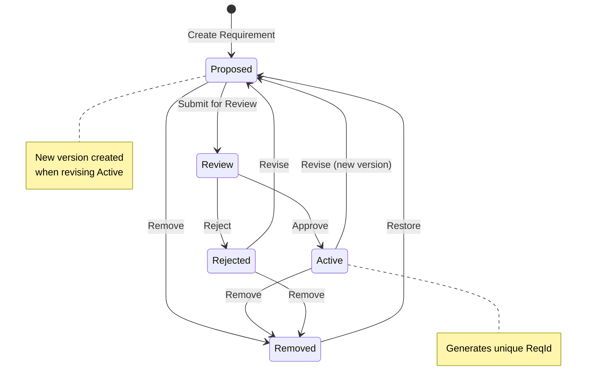

## Getting Started

### Prerequisites

- [VS Code](https://code.visualstudio.com/)
  - `choco install vscode`
- WSL2
  - [WSL2 Installation Guide](https://docs.microsoft.com/en-us/windows/wsl/install)
- [Docker Desktop](https://www.docker.com/products/docker-desktop/)
  - `choco install docker-desktop`
- [pgAdmin](https://www.pgadmin.org/)
  - `choco install pgadmin4`

## Project Setup

1. Update your local machine hosts file to include the following entry:

```
127.0.0.1 cathedral.local
```

2. Start Docker Desktop.
3. Open the project in VS Code.
4. The project should automatically detect the `.devcontainer` folder and ask you to reopen the project in a container. Before doing so, Copy the `.env.example` file to `.env` and fill in the necessary values.
5. Reopen the project in the dev container. (You can also do this by clicking on the blue button in the bottom left corner of the window.)
6. The project will now start downloading the necessary dependencies and setting up the environment.
  1. Docker images
  2. Node modules
  3. VS Code extensions

## Database population

There are a number of commands defined in `package.json` that can be run to populate the database with data:

1. `npm run orm-create-db`
2. `npm run orm-run-pending-migrations`
3. `npm run orm-seed-users`

## Running the project

The project can be run in debug mode via: `npm run dev`. You can then access the application at `https://cathedral.local`.

A production build can be run via: `npm run build` followed by `npm run preview`. You can then access the application at `https://cathedral.local`.

## Data model

The database is in Version Normal Form to support temporal data. More details available [here](https://github.com/final-hill/cathedral/issues/435).

## Application Architecture

The application is a [monolith](https://martinfowler.com/bliki/MonolithFirst.html) following a layered architecture. The application is split into the following layers:

### Server

- domain
   - Entities & Value Objects
- data
   - models (used by MikroORM)
- api
   - This is currently blending the application and infrastructure layers. This will be refactored in the future by separating the application and infrastructure layers.

### Client

- pages
- components
- layouts

## CI/CD Notes

The Infrastructure is managed by Azure Bicep. The CI/CD pipeline is managed by GitHub Actions.
Communication between GitHub and Azure is managed by OpenID Connect.

- [Configuration details](https://learn.microsoft.com/en-us/azure/azure-resource-manager/bicep/deploy-github-actions?tabs=CLI%2Copenid)
  - [Supporting details](https://learn.microsoft.com/en-us/azure/developer/github/connect-from-azure?tabs=azure-cli%2Cwindows#use-the-azure-login-action-with-openid-connect)
- [GitHub Environment details](https://docs.github.com/en/actions/administering-github-actions/managing-environments-for-deployment)

## Slackbot testing

Create an ngrok tunnel to the local server:

```bash
ngrok http https://localhost:3000
```

Update the Slackbot configuration (Event Subscriptions) to point to the generated ngrok tunnel.

`https://<ngrok-url>/api/slack`

Note that this will only work if the server is running locally (`npm run dev`).

Once the local server is stopped, the ngrok tunnel will be closed and the Slackbot will no longer work.

## Requirements Workflow

The Cathedral application implements a comprehensive workflow system for managing requirements throughout their lifecycle. This workflow ensures quality control, proper review processes, and maintains traceability of all requirement changes.

### Workflow States

Requirements in Cathedral follow a five-state workflow:

#### 1. **Proposed**
- **Purpose**: Initial state for newly created requirements
- **Description**: Requirements that have been submitted but not yet reviewed or approved
- **Actions Available**:
  - **Edit**: Modify the requirement content while maintaining the Proposed state
  - **Submit for Review**: Move the requirement to the Review state
  - **Remove**: Move the requirement to the Removed state

#### 2. **Review** (also called "In Review")
- **Purpose**: Requirements undergoing evaluation for approval
- **Description**: Requirements that are being assessed for correctness, completeness, and alignment with project goals
- **Actions Available**:
  - **Review**: Open the review dialog to approve or reject the requirement
  - **Approve**: Move the requirement to the Active state and generate a unique `ReqId`
  - **Reject**: Move the requirement to the Rejected state

#### 3. **Active**
- **Purpose**: Approved and officially part of the project
- **Description**: Requirements that have been reviewed, approved, and are currently being implemented or maintained
- **Actions Available**:
  - **Revise**: Create a new version in the Proposed state (original remains Active until the revision is approved)
  - **Remove**: Move the requirement to the Removed state

#### 4. **Rejected**
- **Purpose**: Requirements that were reviewed but not approved
- **Description**: Requirements that failed review and need revision before resubmission
- **Actions Available**:
  - **Revise**: Modify and move back to the Proposed state for another review cycle
  - **Remove**: Move the requirement to the Removed state

#### 5. **Removed**
- **Purpose**: Requirements that have been deleted from active consideration
- **Description**: Requirements that are no longer part of the project but are preserved for audit trails
- **Actions Available**:
  - **Restore**: Return the requirement to the Proposed state

### Workflow Transitions

The following state transitions are supported:



Text representation:
```
Proposed → Review (Submit for Review)
Proposed → Removed (Remove)

Review → Active (Approve)
Review → Rejected (Reject)

Active → Proposed (Revise - creates new version)
Active → Removed (Remove)

Rejected → Proposed (Revise)
Rejected → Removed (Remove)

Removed → Proposed (Restore)
```

### Permission Requirements

All workflow operations require specific permission levels:

- **Organization Reader**: Can view requirements in all states
- **Organization Contributor**: Can perform all workflow operations (create, edit, review, approve, reject, remove, restore)
- **Organization Admin**: Has all contributor permissions plus user management capabilities

### Implementation Details

#### API Endpoints

The workflow is implemented through RESTful API endpoints following the pattern:
- `PUT /api/requirements/[reqType]/propose` - Create new requirement
- `POST /api/requirements/[reqType]/proposed/[id]/edit` - Edit proposed requirement
- `POST /api/requirements/[reqType]/proposed/[id]/review` - Submit for review
- `POST /api/requirements/[reqType]/proposed/[id]/remove` - Remove proposed requirement
- `POST /api/requirements/[reqType]/review/[id]/approve` - Approve requirement
- `POST /api/requirements/[reqType]/review/[id]/reject` - Reject requirement
- `POST /api/requirements/[reqType]/rejected/[id]/revise` - Revise rejected requirement
- `POST /api/requirements/[reqType]/rejected/[id]/remove` - Remove rejected requirement
- `POST /api/requirements/[reqType]/active/[id]/edit` - Revise active requirement
- `POST /api/requirements/[reqType]/active/[id]/remove` - Remove active requirement
- `POST /api/requirements/[reqType]/removed/[id]/restore` - Restore removed requirement

#### UI Components

The workflow is primarily managed through the `XWorkflow.vue` component, which provides:
- Tabular display of requirements with state-based filtering
- Context menus with appropriate actions for each state
- Modal dialogs for editing, reviewing, and confirming operations
- Real-time state updates and notifications

## Troubleshooting

Most issues can be resolved by restarting the dev container. This can be done by closinng and reopening VSCode. Don't do this too quickly. When VSCode is closed, the Docker containers take some time to stop.

If you are still having issues, try deleting the containers and images and restarting the dev container.

If you run into issues related to npm install hanging ([Known bug](https://github.com/npm/cli/issues/4028)). You can try running `npm install` on each dependency individually. For example: `npm install @mikro-orm/core`, `npm install nuxt`, etc. This is a worst case scenario and seems to surface intermittently. The bug is potentially related to IPV6.
