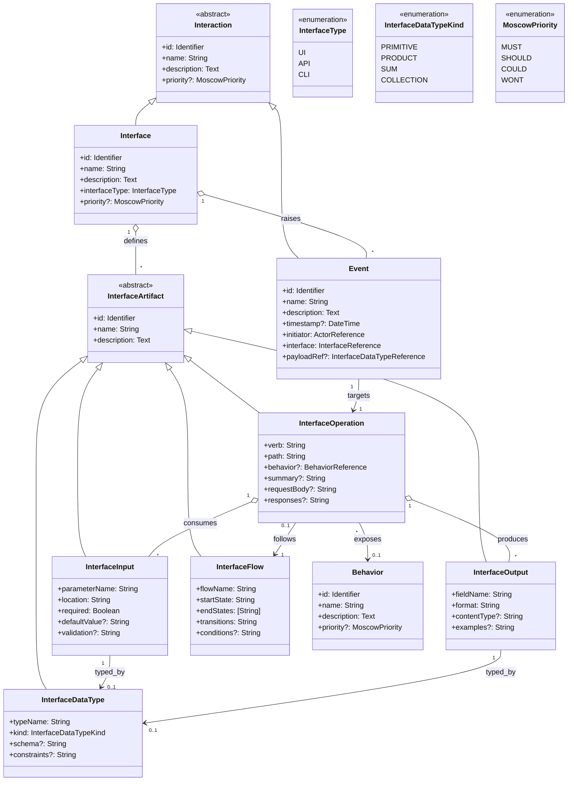

# Goal

The goal is to implement the System->Interfaces page (S.3 Interfaces) and update the implementation of the E.2 page (Environment Components) to support Interface definitions

This page (S.3) describes how the System makes the Functionality of S.2 (Functional Behavior and Non-Functional Behavior) available to the rest of the world, particularly user interfaces (UIs), program interfaces (APIs), and Command Line Interfaces (CLIs). It specifies how the functionality will be made available to the rest of the world, including people (users) and other systems. These are interfaces provided by the system to the outside; the other way around, interfaces from other systems, which the system may use, are specified in E.2 in the Environment section (Environment Components)

The Environment Components page lists elements of the environment that may affect or be affected by the system and project. Includes other systems to which the system must be interfaced. These components may include existing systems, particularly software systems, with
which the system will interact by using their APIs (program interfaces), or by providing
APIs to them, or both. These are interfaces provided to the system from the outside world.
They are distinct from both: interfaces provided by the system to the outside world (covered
in S.3 in the Systems section);  and technology elements that the system’s development will
require (covered in P.5 page Project section)

## Interface Formalisms

Formalisms do exist for CLIs and APIs. UIs are less formalized and can vary widely in their design and implementation.

### CLIs

Formalisms here typically focus on the grammar of commands, arguments, and options.

I think [Docopt](http://docopt.org/) is an appropriate formalism for defining CLIs.
It defines CLI syntax using usage patterns in text, essentially treating help text as the grammar.

Example:

```text
Naval Fate.

Usage:
  naval_fate ship new <name>...
  naval_fate ship <name> move <x> <y> [--speed=<kn>]
  naval_fate ship shoot <x> <y>
  naval_fate mine (set|remove) <x> <y> [--moored|--drifting]
  naval_fate -h | --help
  naval_fate --version

Options:
  -h --help     Show this screen.
  --version     Show version.
  --speed=<kn>  Speed in knots [default: 10].
  --moored      Moored (anchored) mine.
  --drifting    Drifting mine.
```

### APIs

Formalisms here describe contracts, types, and communication protocols:

- IDLs (Interface Definition Languages)
    - CORBA IDL, Thrift, Protocol Buffers, Apache Avro, Cap’n Proto
    - Define API signatures, message formats, and data types independent of language.
- Web APIs
    - OpenAPI (Swagger): JSON/YAML schema-based formalism for describing RESTful APIs.
    - GraphQL SDL (Schema Definition Language): A formal schema language for GraphQL APIs.
    - gRPC: Uses Protocol Buffers as its formal schema.
- WSDL (Web Services Description Language)
    - XML-based formalism for SOAP APIs (now legacy but very precise).
- Algebraic/Formal Approaches
    - Hoare Logic / Contracts / Larch / JML: Formal methods for specifying API pre/postconditions and invariants.
    - Session Types: Formalism from process calculi to model protocol correctness in APIs (who sends what, when).

The most common modern approaches here are:

1. REST + OpenAPI (Swagger)
2. GraphQL + SDL (Schema Definition Language)
3. gRPC + Protocol Buffers
4. The [WHATWG Web IDL](https://webidl.spec.whatwg.org/) is also a notable formalism for defining web APIs.

[AsyncAPI](https://www.asyncapi.com/en) is also gaining traction for defining event-driven APIs. It's representation is analogous to Swagger.

### UIs

UIs don’t have a universally accepted formalism. The closest are statecharts, task models, and markup languages.

Options:

- Statecharts (SCXML, XState): Excellent for behavioral specs (what screens/states exist, how transitions happen).
- IFML (OMG standard): Overlooked but real — a UML-family formalism for UIs and interaction flow.
- Declarative Markup (HTML/XAML/QML/FXML): Familiar to devs, but too implementation-leaning for requirements.
- SVG/WYSIWYG Mockups: Great for visual structure, but poor for interaction semantics.
- Task Models (CTT): More academic, but could nicely capture user goals → interaction paths.

I think what is likely wanted here is an embedded SVG Editor. What's been reviewed:

- https://wireframe.cc/
    - I like the minimalism of this.
    - Not Open source or embeddable
- https://github.com/jgraph/drawio
    - https://app.diagrams.net/
    - The Closest in behavior to what is desired, but it would need to be simplified
    - Potentially embeddable, but not open source
    - Not customizable
- https://github.com/tldraw/tldraw
    - https://tldraw.dev/
    - This looks to be for drawing, not mockups
- https://github.com/excalidraw/excalidraw
    - https://excalidraw.com/
    - This is also more so an ad-hoc drawing tool
- http://framebox.org/
    - Seems very dated (2012) and too simplistic
    - No grouping, hierarchy, and other basic SVG concepts are missing
    - No code available?
- https://freesvgeditor.com/en
    - Very simple, no code available?
- https://www.npmjs.com/package/svgedit
    - Very old, but functional
    - predefined complex objects will need to be defined
    - The repository seems semi-active.

We could use <https://d3js.org/> and build what is needed custom. This is starting to seem like the best approach

## The Relationship to Use Cases and Behaviors

A [UseCase](shared/domain/requirements/UseCase.ts) describes a complete interaction between an Actor and the System to achieve a Goal (Outcome). Thus the relevance here is that there is a `trigger` reference on the entity that points to the `InterfaceOperationReference` that initiates the Use Case.

InterfaceOperation provides a precise representation of the specific operation (verb, path, initiator) that triggers the Use Case, replacing the previously vague EventReference concept.

### Interface-Behavior Association

**ARCHITECTURAL REFINEMENT (2025-09-03)**: The relationship between Interfaces and Behaviors has been refined for greater precision and tooling clarity.

#### Original Approach (Deprecated)
Initially, we modeled a direct many-to-many relationship between Interface and Behavior entities via a `behaviors` field on Interface. This approach had several limitations:

1. **Architectural Vagueness**: The relationship didn't specify *how* or *where* behaviors were exposed within the interface
2. **Tooling Limitations**: Difficult to answer precise questions like "Which specific operation exposes this behavior?"
3. **Unstructured Web**: Risk of creating an ambiguous cross-linking system without clear operational semantics

#### Refined Approach (Current)
The relationship has been moved to the **InterfaceOperation** level, establishing a precise **InterfaceOperation ↔ Behavior** mapping:

- **Interface**: Container/aggregate root that groups related operations
- **InterfaceOperation**: Atomic unit where behaviors are actually exposed (endpoints, commands, UI controls)
- **Behavior**: Abstract capability that can be exposed through multiple operations across different interfaces

#### Architectural Principle
```
Interface
  ├── InterfaceOperation * --- 1 Behavior (primary)
  ├── InterfaceOperation * --- 1 Behavior (primary)
  └── InterfaceOperation * --- 1 Behavior (primary)
```

Each **InterfaceOperation references exactly one primary Behavior**, while a **Behavior may be exposed by multiple InterfaceOperations** across different interfaces (ManyToOne at operation level, aggregating to ManyToMany at interface level).

#### Example: "Create User" Behavior
```
Behavior: Create User

Interfaces exposing this behavior:
- UserAPI (ProgramInterface)
    - Operation: `POST /users` → exposes Create User
- UserUI (UserInterface)
    - Operation: Registration Form Submit → exposes Create User
- UserCLI (CLI Interface)
    - Operation: `userctl create --name John` → exposes Create User
```

#### Benefits of This Approach
1. **Precise Mapping**: Clear answer to "Which operation exposes this behavior?"
2. **Natural Aggregation**: Interface-level behavior exposure emerges from its operations
3. **Tooling Clarity**: Enables precise traceability, impact analysis, and validation
4. **Modality Independence**: Works equally well for APIs (endpoints), CLIs (commands), and UIs (controls)
5. **Architectural Consistency**: The *operation* is the true locus of behavior exposure across all interface types

This refinement aligns with the document's principle that "InterfaceOperation" is the "Abstract unit of interaction" - the atomic level where system behaviors meet external actors.

## Challenge: A Unifying model

We've got:

- An underlying Requirements Algebra (formal core, system of record).
- The challenge: how to let users define Interfaces (API, CLI, UI) in a way that is usable but maps cleanly back into the algebra.
- The outcome: a clearer understanding of what Domain Entities are needed to support Interfaces.


### 1. First Principles: What is an "Interface" in Requirements Terms?

At its core, an Interface is a contract between a system and its environment. In PEGS / SysML language:

- System: The thing we're building.
- Environment: External actors, other systems, users.
- Interface: The boundary of interaction.

So every interface has:

- Endpoints (operations, commands, UI screens).
- Inputs (parameters, options, user actions).
- Outputs (responses, results, UI updates).
- Protocols/Constraints (ordering, pre/post-conditions, allowed values).

This is remarkably consistent across API, CLI, UI — only the representation differs.

### 2. User Presentation Approaches

#### APIs

- Schema-first editor (OpenAPI-style).
- Show data types (class diagram-ish).
- Show endpoints (operation list).

#### CLIs

- Command palette metaphor.
- Tree view: command → options → arguments.
- Optionally a UML Activity diagram view for flows.
- Or simply the Docopt-style text definition.

#### UIs

- Wireframe/WYSIWYG for layout (SVG).
- Statechart view for behavior.
    - I'm not sure this belongs in the UI editor though since there are other pages that manage scenario steps and such...
- (Optional) Task flow diagram for usability/interaction clarity.

### 3. Mapping to Domain Entities

To keep the Requirements Algebra consistent, we'd want shared abstractions under the hood:

| Concept (User-facing)                             | Domain Entity (Core)   | Notes                                                 |
| ------------------------------------------------- | ---------------------- | ----------------------------------------------------- |
| Endpoint / Command / Screen                       | **InterfaceOperation** | Abstract unit of interaction.                         |
| Input Parameter / Option / Field                  | **InterfaceInput**     | Typed, constrained, may reference domain entities.    |
| Output / Response / Display                       | **InterfaceOutput**    | Same as above, often references Result/Domain Entity. |
| Data Schema (JSON, struct, form)                  | **InterfaceDataType**  | Algebraic type (sum/product), constraints.            |
| Flow (API sequence, CLI branching, UI navigation) | **InterfaceFlow**      | Graph of operations (state machine / activity).       |

So we'd unify API, CLI, UI under the same algebra:

- An API "endpoint" = a CLI "command" = a UI "screen transition."
- An argument = a request body field = a form input field.
- A return value = an HTTP response = console output = UI update.

### 4. Practical Example

Take a "Check Shipment Price" requirement.

- API: `POST /price { shipment } -> { priceResult }`
- CLI: `price-check --shipment <file.json>`
- UI: Screen with a "Shipment" form -> shows "Price result."

Under the hood, all three would map to:

```
Behavior: CalculateShippingCost

InterfaceOperations exposing this behavior:
- Interface: ShippingAPI (API)
    - Operation: CheckPrice
        - Behavior: CalculateShippingCost (primary)
        - Verb: POST
        - Path: /price
        - Inputs: Shipment (InterfaceDataType)
        - Outputs: PriceResult (InterfaceDataType)

- Interface: ShippingCLI (CLI)
    - Operation: PriceCheck
        - Behavior: CalculateShippingCost (primary)
        - Verb: check
        - Path: price-check
        - Inputs: --shipment <file.json>
        - Outputs: PriceResult (console)

- Interface: ShippingUI (UI)
    - Operation: PriceCalculation
        - Behavior: CalculateShippingCost (primary)
        - Action: form-submit
        - Inputs: Shipment form fields
        - Outputs: PriceResult (screen display)
```

The presentation differs, but the **InterfaceOperation ↔ Behavior** mapping provides the precise algebraic core that's consistent across all interface modalities.

### 5. Recommendation

- Present API, CLI, UI editors in the most natural form for each user type.
- Internally, normalize them into InterfaceOperation / Input / Output / Flow / Actor entities in the  Requirements Algebra.
- Consider defining a UML Profile or SysML-like meta-model for "Interface" so we have a visual + formal notation.

Note The Algebra is hidden from the end user. We don't want them editing that directly ever in the Cathedral system. The philosophy is a View-Model approach that tailors display differently per Persona. (the Personas are not defined at this point)

#### Aside: View-Model mapping examples

- API View (Developer Persona)
    - Show as OpenAPI YAML/Swagger editor.
    - Under the hood: maps to `InterfaceOperation + Inputs + Outputs.`
- CLI View (Developer/Tech Persona)
    - Show as Docopt-style usage string or activity diagram.
    - Under the hood: maps to the same `InterfaceOperation`.
- UI View (BA/End-User Persona)
    - Show as wireframe/WYSIWYG + optional state diagram.
    - Under the hood: `InterfaceFlow + Inputs + Outputs`.
- Requirements View (BA Persona)
    - Natural-language templates:
        `When [Actor] provides [Inputs], the system performs [Operation] and returns [Outputs].`
    - Under the hood: same mapping.

### Domain Model

What category of requirement do Interfaces belong to (S.3.#)? What would a reasonable common super class be for Functionality (S.2) , Interfaces (S.3), and Scenarios (S.4 - User Stories and Use Cases)?

The reason a common super class is wanted is because the items of S.2, S.3 and S.4 are all items that are prioritized

From Meyer's Handbook of Requirements and Business Analysis, the System (S) section is broken down as:

- S.1 Components
- S.2 Functionality
- S.3 Interfaces
- S.4 Detailed usage scenarios
- S.5 Prioritization
- S.6 Verification and acceptance criteria

So:

- Functionality (S.2) = what the system does
- Interfaces (S.3) = how external actors (users, systems) interact with the system
- Scenarios (S.4) = structured narratives of use

Interfaces sit between behavior and scenarios:

- Behaviors are abstract, capability-level descriptions.
- Interfaces are concrete points of contact where behaviors are exposed.
- Scenarios are stories of actual usage that traverse behaviors and interfaces.

Thus Interfaces shouldn't be children of Behavior, nor should they be parallel to Scenario. They need their own node, but grouped with S.2 and S.4 under a higher-level abstraction in order to associate at least the Prioritization. Then again, the concept of Prioritization may be better represented as a trait/mixin

A good candidate abstraction could be: `Interaction` (or `SystemInteraction`)

- Encompasses what the system does (Functionality),
- where/how it is accessed (Interfaces),
- how it is used in context (Scenarios).

Here is the current domain model (is-a hierarchy):

```
Requirement (base for all requirements)
│
├── Goal
│   ├── ContextAndObjective (G.1.#)
│   ├── Obstacle (G.2.#)
│   ├── Outcome (G.3.#)
│   ├── Functionality (G.4.#)
│   └── Epic (G.5.#)
│
├── BehaviorBase
│   ├── Example
│   └── Behavior
│       ├── FunctionalBehavior (S.2.1.#)
│       └── NonFunctionalBehavior (S.2.2.#)
│
├── InteractionRequirement
│   └── Event (S.3.#)
│
├── Scenario
│   ├── UseCase (S.4.2.#)
│   ├── UserStory (S.4.1.#)
│   ├── ScenarioStep
│   └── TestCase (S.6.#)
│
├── Actor
│   ├── Person (P.1.#)
│   └── Component
│       ├── EnvironmentComponent (E.2.#)
│       ├── SystemComponent (S.1.#)
│       ├── GlossaryTerm (E.1.#)
│       └── Stakeholder (G.7.#)
│
├── Responsibility
│   └── Role
│
├── MetaRequirement
│   ├── ParsedRequirements (P.7.#)
│   ├── Justification
│   ├── Goals
│   ├── Project
│   ├── System
│   ├── Solution
│   ├── Environment
│   └── Organization
│
├── Task
├── Constraint (E.3.#)
├── Invariant (E.6.#)
├── Effect (E.5.#)
├── Assumption (E.4.#)
├── Limit (G.6.#)
├── Silence
├── Product (P.2.#)
└── Noise
    └── Hint
```

I think `InteractionRequirement` gets renamed to `Interaction`. The new hierarchy being:

```text
├── Interaction    [abstract]
│   ├── Interface (S.3.#)
│   │   └── InterfaceArtifact [abstract]
│   │       ├── InterfaceOperation
│   │       ├── InterfaceInput
│   │       ├── InterfaceOutput
│   │       ├── InterfaceDataType
│   │       └── InterfaceFlow
│   │
│   ├── Event
│   │
│   └── Scenario (S.4.#) [existing]
│       ├── UseCase (S.4.2.#) <: Prioritizable    [has Trigger → Event]
│       ├── UserStory (S.4.1.#) <: Prioritizable
│       └── TestCase (S.6.#)
│
├── BehaviorBase
│   ├── Example
│   └── Behavior
│       ├── FunctionalBehavior (S.2.1.#) <: Prioritizable
│       └── NonFunctionalBehavior (S.2.2.#) <: Prioritizable
...
```

## Implementation Notes

Creating the editing for CLIs is the easiest of the three but also the least likely to be used, so let's not tackle that first.

The UI editor would be the hardest since I think we need to implement a WYSIWYG via D3.js from scratch.

That leaves us with implementing the API editor first. I think we start with a simple yaml based OpenAPI editor. This can have syntax highlighting and validation via a library. But what is an `Event` that the UseCase trigger can reference?


A rough mermaid diagram of relationships:



### InterfaceFlow vs UseCase Scenario steps

Given that the Cathedral platform has a means to define UseCases with scenario steps, how does that
relate to the InterfaceFlow you suggested? Is this redundant? Complementary?

1. Use Case Scenario Steps
    - These are requirements-level narratives: "The user logs in → system verifies credentials → user is shown dashboard."
    - They are actor/system interactions in sequence, written in natural language (Cockburn style).
    - Purpose: capture intent, goals, and success/failure paths.
    - They reference Interfaces indirectly (“login screen,” “credentials API”) but are not bound to their internals.
2. InterfaceFlow (Artifact-level)
    - This is a structural/technical flow: how InterfaceOperations connect and transition (like a finite state machine or activity diagram).
    - Example: LoginOperation → Success → DashboardOperation; LoginOperation → Failure → RetryOperation.
    - Captures navigation, branching, sequencing at the interface level.
    - Purpose: ensure the interface’s internal consistency (can all paths be reached? are there dead-ends?).
3. Relationship: Complementary, not redundant
    - Think of them as two layers of the same thing:
        - UseCase Steps: User’s perspective of the interaction flow, contextualized by goals.
        - InterfaceFlow: System’s perspective of the interaction flow, formalized at the artifact level.

A UseCase step like:

> "System presents the login screen"

... maps to an InterfaceFlow transition:

`[Start] → LoginScreenOperation`

And another step:

> "System navigates to dashboard on success"

... maps to an InterfaceFlow transition:

`LoginOperation.success → DashboardOperation`

4. Practical consequence in Cathedral

- When the BA/Architect defines UseCase scenario steps, these can reference or validate against the existing InterfaceFlow.
- InterfaceFlows ensure that what the UseCase describes is implementable and consistent with the defined interfaces.
- Conversely, missing flows (e.g., no "failure path" in the Interface) could be flagged when writing UseCases.

Summary:

UseCase scenario steps = narrative, requirements-facing.

InterfaceFlow = structural, system-facing.

They are complementary, with UseCases consuming and validating InterfaceFlows.

## Problem with OpenAPI Yaml Editing (2025-09-02)

After review, a yaml editor for OpenAPI definitions is not a good approach:

1. Model mismatch:
    - Cathedral is component-first.
    - OpenAPI is API-first (a single giant surface for a deployed service). So forcing authors to directly edit OpenAPI YAML inside Cathedral makes the UI and mental model fight against the algebra.
2. Tool mismatch:
    - OpenAPI YAML editing isn’t really friendly unless you use a heavyweight editor ([Swagger Editor](https://editor.swagger.io/), [Scalar](https://guides.scalar.com/scalar/introduction), etc.), which don’t embed neatly into the UI since they are full applications in themselves.
    - [Monaco ](https://microsoft.github.io/monaco-editor/) can handle YAML (syntax highlighting, but we need schemas, validations, completions, and it’s still very “raw text.” The validation and schemas don't come out-of-the-box yet, so an extension project was made ["monaco-yaml"](https://github.com/remcohaszing/monaco-yaml), but after some experimentation, it breaks when trying to couple with Nuxt.

### A Better way

- Define Interfaces inside Cathedral using structured forms:
    - For InterfaceOperation: name, verb (GET/POST/PUT/DELETE), path template, description.
    - For InterfaceInput/Output: data types, required flags, constraints.
    - For InterfaceFlow: navigation or sequencing.
- This is much closer to the way analysts and architects think.
- Cathedral stores this as its internal algebra.

Then On demand, in a future iteration, generate OpenAPI YAML (either per-component fragments or a bundled system view).

### Analogy

Think of it like ER diagrams vs SQL DDL:

- Nobody expects an analyst to handwrite a giant schema.sql.
- They use a form/diagram tool to define entities + relationships.
- Then the tool generates the SQL.

Same with Cathedral:

- Analysts define Interfaces and Operations through structured inputs.
- Cathedral generates OpenAPI when you need the interoperability.

### Example

Let’s say we have a Book component.

- Component: `Book`
- Interface: `BookAPI` (type: ProgramInterface)
    - Operation: `GET /books/{id}`
        - Input: `id : UUID` (required)
        - Output: `BookDTO` (title, author, ISBN)
    - Operation: `POST /books`
        - Input: `BookCreateRequest` (title, author)
        - Output: `BookDTO`

So, in a future iteration an OpenAPI fragment could be generated:

```yaml
paths:
  /books/{id}:
    get:
      summary: Get book by ID
      parameters:
        - in: path
          name: id
          schema: { type: string, format: uuid }
          required: true
      responses:
        '200':
          description: OK
          content:
            application/json:
              schema: { $ref: '#/components/schemas/BookDTO' }
  /books:
    post:
      summary: Create a book
      requestBody:
        content:
          application/json:
            schema: { $ref: '#/components/schemas/BookCreateRequest' }
      responses:
        '200':
          description: OK
          content:
            application/json:
              schema: { $ref: '#/components/schemas/BookDTO' }
```

Cathedral never forces you to edit this YAML directly; it’s just an export artifact.

## LLM Feedback Notes

### Key Decisions from Discussion

1. **Interface Scope**: Interfaces are scoped to Solutions (like other requirements). Cross-solution reuse will be addressed in future Portfolio/Program management iterations.

2. **Event Auto-Generation Strategy**:
   - **Challenge**: Three different interface types (API, CLI, UI) have varying levels of structure
   - **API/CLI**: Formalized structure allows automatic event generation from operations
   - **UI**: SVG/D3.js approach could provide structured interactive elements for event generation
   - **Concern**: Subsequent edits need orphaned event cleanup mechanism
   - **Decision**: Start with manual Event creation, explore auto-generation in Phase 4

3. **Implementation Priority**: API → CLI → UI
   - **API**: Moderate effort, high value, form-based approach
   - **CLI**: Low effort, low usage, but relatively trivial to implement
   - **UI**: High effort, high value, most complex (custom D3.js implementation)

4. **UI Editor Approach**: Custom SVG-based wireframe editor using D3.js for structured interactive elements

5. **Domain Model Clarification**:
   - UserEvent and SystemEvent collapsed into single Event entity
   - Event.initiator field of type Actor covers both Person and Component initiators
   - Simplified hierarchy: Interaction → [Interface, Event, Scenario]

6. **API Editor Strategy Pivot** (2025-09-02):
   - **Abandoned**: OpenAPI YAML editing approach due to model mismatch and tool complexity
   - **Model Mismatch**: Cathedral is component-first vs OpenAPI's service-first monolithic approach
   - **Tool Complexity**: Monaco/monaco-yaml integration proved fragile and overly complex
   - **User Experience**: Raw YAML editing is developer-centric, not analyst/architect-friendly
   - **New Approach**: Form-based interface definition using Cathedral's natural requirements concepts

### Refined Implementation Strategy

**Phase 1: Foundation (Domain Model Refactoring)**
- Rename InteractionRequirement → Interaction (abstract base)
- Move Scenario under Interaction hierarchy
- Create Interface entity under Interaction
- Update Event to extend Interaction and add interfaceRef field
- Create InterfaceArtifact hierarchy (5 building block entities)
- Update ReqType enum and all references
- Implement basic CRUD following existing patterns

**Phase 2: Form-Based API Interface Editor**
- **Interface Management**: Create/edit Interface entities with metadata (name, type, priority)
- **Operation Builder**: Add/edit/delete InterfaceOperations with form inputs
- **Input/Output Definition**: Structured forms for parameters and responses
- **Data Type Management**: Visual builder for InterfaceDataTypes with algebraic type support
- **Navigation**: Visual operation listing with inline editing capabilities
- **Storage**: All data stored in Cathedral's algebra, not external formats
- **No OpenAPI Export**: Focus purely on requirements capture, not external format generation

**Phase 3: Event-Interface Integration**
- UseCase trigger dropdown showing Interface operations
- Validation and traceability views

**Phase 4: CLI Support + Event Auto-generation**
- Docopt editor for CLI interfaces
- Explore automatic Event generation with orphan cleanup

**Phase 5: UI Wireframe Editor (Future)**
- Custom D3.js-based SVG editor
- Interactive element definition for event generation

### Form-Based API Editor Design Principles

1. **Requirements-Centric**: Users work with Interface/Operation/Input/Output concepts, not OpenAPI specifications
2. **Progressive Disclosure**: Start simple (operation name/verb/path), add complexity as needed
3. **Visual Operation Management**: Clear listing of operations with quick edit capabilities
4. **Type System Integration**: Leverage Cathedral's InterfaceDataType system for reusable schemas
5. **Validation**: Client-side validation for required fields, path syntax, data type consistency
6. **Workflow Integration**: Standard Cathedral approval/review process for interface changes

## Implementation Progress

### ✅ Phase 1: Foundation (Domain Model Refactoring) - COMPLETE

- ✅ Renamed `InteractionRequirement` → `Interaction` (abstract base)
- ✅ Created `Interface` entity extending `Interaction`
- ✅ Updated `Event` to extend `Interaction` with proper references:
  - `initiator: ActorReference` (supports both Person and Component)
  - `interface: InterfaceReference` (links to Interface operations)
- ✅ Created complete `InterfaceArtifact` hierarchy:
  - `InterfaceOperation` (endpoints/commands/screens)
  - `InterfaceInput` (parameters/fields)
  - `InterfaceOutput` (responses/displays)
  - `InterfaceDataType` (schemas with `InterfaceDataTypeKind` enum)
  - `InterfaceFlow` (navigation/sequencing)
- ✅ Updated `ReqType` enum with new interface types
- ✅ Implemented comprehensive ORM models with all properties
- ✅ Native enum integration (`InterfaceType`, `InterfaceDataTypeKind`, `MoscowPriority`)
- ✅ Enhanced type system with proper TypeScript support
- ✅ **ARCHITECTURAL REFINEMENT (2025-09-03)**: Moved Interface-Behavior relationship to operation level
  - **Removed**: `behaviors` field from Interface entities (vague many-to-many)
  - **Added**: `behavior` field to InterfaceOperation entities (precise one-to-many)
  - **Motivation**: Eliminates architectural vagueness, enables precise tooling, creates clear operational semantics
  - **Pattern**: InterfaceOperation ↔ Behavior (atomic unit where behaviors are exposed)
- ✅ **DOMAIN MODEL CONSISTENCY (2025-09-04)**: Eliminated operationId redundancy from InterfaceOperation
  - **Removed**: `operationId` field from InterfaceOperation entities (redundant with inherited name)
  - **Motivation**: InterfaceOperation extends Requirement base class which already provides `name` property
  - **Pattern**: Use inherited properties consistently instead of creating duplicate identifiers
  - **Impact**: Simplified domain model, reduced cognitive load, improved form generation consistency
- ✅ All TypeScript compilation passing

### 🔄 Ready for Phase 2: API Interface Editor

The domain foundation is now complete and ready for:
- API endpoint CRUD operations following existing `/api/requirements/[reqType]/` pattern
- OpenAPI YAML editor with validation
- Form-based interface creation and editing
- Integration with workflow states and approval processes

### 🎯 Next Steps

1. **API Routes**: Implement CRUD operations for Interface and InterfaceArtifact entities
2. **Interface Editor UI**: Create form-based interface for API definition
3. **Event Integration**: Connect Interface operations to UseCase triggers
4. **Validation**: Add OpenAPI schema validation and constraints

