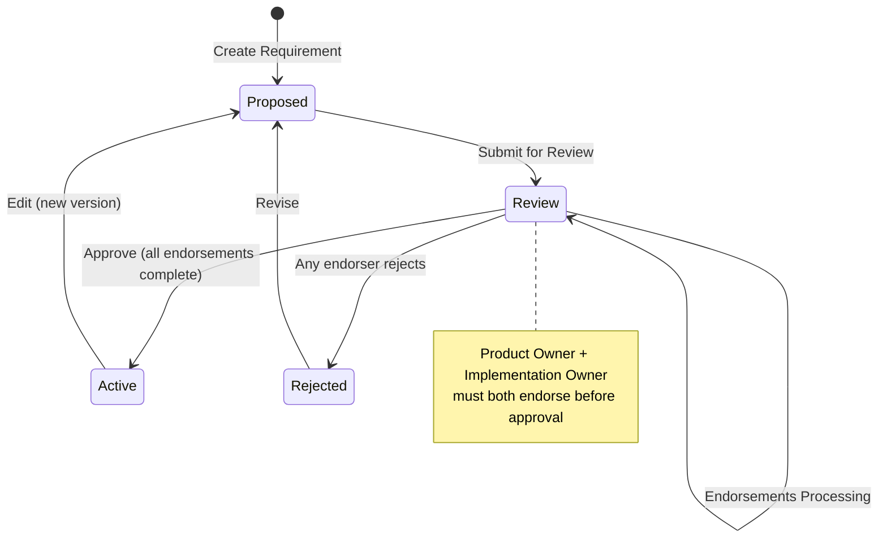

# Requirement Endorsement Implementation Plan

## Overview

This document outlines the implementation plan for Requirement Endorsement functionality as described in [GitHub Issue #433](https://github.com/final-hill/cathedral/issues/433). The feature ensures that requirements are properly validated by designated key stakeholders before becoming active.

## Business Requirements

### Core Requirements
1. **Mandatory Endorsement**: All requirements MUST be endorsed before approval
2. **Key Stakeholder Roles**: Two mandatory roles for endorsement:
   - **Product Owner**: Represents business needs and user requirements
   - **Implementation Owner**: Accountable for technical feasibility and architecture alignment
3. **Endorsement Validation**: Requirements cannot be approved without endorsements from both key stakeholder roles
4. **Rejection with Reason**: Endorsers can reject requirements with mandatory commentary
5. **Audit Trail**: Complete tracking of endorsement history and decisions

### Extended Requirements
1. **Flexible Stakeholder Assignment**: Support for additional endorsers beyond the mandatory two
2. **Vendor/Client Scenarios**: Handle third-party contracting scenarios where legal ownership varies
3. **Project Sponsor Consideration**: Optional inclusion of high-influence stakeholders

## Architecture Overview

### Clean Architecture Layers

```
Presentation Layer (Web UI)
├── RequirementReview.vue (enhanced with endorsement panel)
├── Existing generic pages (sufficient for stakeholder management)

Application Layer (Interactors)
├── RequirementInteractor (enhanced with endorsement methods)

Domain Layer (Business Logic)
├── Endorsement (new entity)
├── Role (existing - enhanced with endorsement flags)
├── EndorsementStatus (new value object)
└── Requirement (enhanced with endorsement references)

Infrastructure Layer (Data/API)
├── EndorsementRepository (new)
├── Enhanced RequirementRepository
└── API endpoints for endorsement operations
```

## Data Model Changes

### New Entities

#### Endorsement
```typescript
import { z } from 'zod'
import { AuditMetadata } from '../AuditMetadata.js'
import { RequirementReference, RoleReference, PersonReference } from './EntityReferences.js'

export const EndorsementStatus = z.enum(['pending', 'endorsed', 'rejected'])
export type EndorsementStatusType = z.infer<typeof EndorsementStatus>

export const Endorsement = AuditMetadata.extend({
  id: z.string().uuid()
    .describe('The unique identifier'),
  requirementId: RequirementReference
    .describe('Reference to the requirement being endorsed'),
  roleId: RoleReference
    .describe('Reference to the role providing the endorsement'),
  status: EndorsementStatus
    .describe('Current status of the endorsement'),
  endorsedAt: z.date().optional()
    .describe('When the endorsement was approved'),
  rejectedAt: z.date().optional()
    .describe('When the endorsement was rejected'),
  comments: z.string().optional()
    .describe('Optional comments from the endorser'),
  endorsedByPersonId: PersonReference.optional()
    .describe('Person who performed the endorsement action')
}).describe('Represents an endorsement of a requirement by a designated role')

export type EndorsementType = z.infer<typeof Endorsement>
```

#### Enhanced Role Entity
```typescript
// Enhanced existing Role.ts
import { Responsibility } from './Responsibility.js'
import { ReqType } from './ReqType.js'
import { PersonReference } from './EntityReferences.js'
import { z } from 'zod'

export const Role = Responsibility.extend({
    persons: z.array(PersonReference).optional()
        .describe('The persons assigned to this role within the project'),

    // New properties for endorsement
    isProductOwner: z.boolean().default(false)
        .describe('Whether this role represents the Product Owner for endorsements'),
    isImplementationOwner: z.boolean().default(false)
        .describe('Whether this role represents the Implementation Owner for endorsements'),
    canEndorseRequirements: z.boolean().default(false)
        .describe('Whether persons in this role can endorse requirements'),

    reqType: z.nativeEnum(ReqType).default(ReqType.ROLE)
}).describe('A role is a responsibility that is assigned to a human being')

export type RoleType = z.infer<typeof Role>
```

**Design Note on `canEndorseRequirements`**: This explicit flag is preferred over deriving endorsement rights from `StakeholderCategory` because:
- **Categories describe influence, not permissions**: StakeholderCategory ("Key Stakeholder", "Shadow Influencer", etc.) describes the stakeholder's relationship and influence pattern within the project, not their operational workflow permissions
- **Business flexibility**: Organizations may need "Key Stakeholders" who provide valuable input but don't formally endorse requirements (e.g., end users, regulatory observers)
- **Clear separation of concerns**: Category defines the stakeholder's project relationship; endorsement permission defines their workflow role
- **Explicit control**: Users have direct, granular control over who can endorse, preventing confusion about implicit permissions

**Architectural Decision: Stakeholder vs Role Separation**: During implementation, we discovered potential overlap between `Stakeholder` and `Role` entities, both of which can have `persons` assigned. After analysis, we decided to maintain the separation:

- **Stakeholder** (`G.7.#` - extends Component): Represents *stakeholder groups* focused on **project politics and analysis**
  - Purpose: "Who cares about the project" (analytical/political view)
  - Examples: "Executive Sponsor", "End User Group", "QA Team" (groups, not individuals)
  - Properties: `category`, `segmentation`, `interest`, `influence`, `persons[]`
  - Focus: Interest/influence mapping, client vs vendor segmentation, stakeholder analysis artifacts

- **Role** (extends Responsibility): Represents *functional responsibilities* focused on **operational workflow**
  - Purpose: "Who does what in the workflow" (operational/functional view)  
  - Examples: "Developer", "Tester", "Product Owner" (functional roles)
  - Properties: `persons[]`, `isProductOwner`, `isImplementationOwner`, `canEndorseRequirements`
  - Focus: Endorsement permissions, functional responsibilities, process workflow

**Rationale**: The same person could be assigned to Stakeholder "Executive Sponsor" (high influence analysis) AND Role "Product Owner" (endorsement permissions). This separation maintains clear boundaries between analytical artifacts and operational workflow, keeping endorsement logic clean and role-focused while preserving stakeholder analysis capabilities.

### Value Objects

#### EndorsementStatus
```typescript
import { z } from 'zod'

export const EndorsementStatus = z.enum(['pending', 'endorsed', 'rejected'])
  .describe('The status of a requirement endorsement')

export type EndorsementStatusType = z.infer<typeof EndorsementStatus>
```

## Workflow Integration

### Enhanced Review Process

1. **Requirement Submission**: When a requirement moves to "Review" state
   - Automatically create pending endorsements for mandatory roles (Product Owner & Implementation Owner)
   - Notify designated stakeholders

2. **Endorsement Phase**: Before approval can occur
   - Product Owner must endorse (business validation)
   - Implementation Owner must endorse (technical validation)
   - Optional additional endorsers can provide input

3. **Approval Validation**: Enhanced approval logic in RequirementInteractor
   - Verify all mandatory endorsements are complete
   - Check for any rejections that block approval
   - Maintain existing reference validation (all referenced requirements must be Active)

4. **Rejection Handling**:
   - Any endorser can reject with mandatory reason
   - Rejection moves requirement to "Rejected" state
   - Clear audit trail of rejection reasoning

### State Transition Updates



**Note**: Endorsements are created when entering Review state. The requirement remains in Review state during the endorsement process until either approved (moves to Active) or rejected by an endorser (moves to Rejected).

## Implementation Plan

### Phase 1: Data Model and Domain Logic

#### 1.1 Domain Entity Definition
- Define `Endorsement` entity with proper MikroORM decorators
- Enhance existing `Role` entity with new endorsement properties
- Create `EndorsementStatus` enum
- Ensure proper entity relationships and constraints

#### 1.2 Database Migration Generation
- Run `npm run orm-create-migration` to generate migration from entity changes
- Review generated migration for correctness
- Test migration with `npm run orm-run-pending-migrations`

#### 1.3 Repository Layer
- Implement `EndorsementRepository` with required methods:
  - `create(endorsement)` - Create new endorsement
  - `updateEndorsement(params)` - Update endorsement status and metadata
  - `findByRequirement(requirementId)` - Get all endorsements for a requirement
  - `findByRequirementAndRole(requirementId, roleId)` - Get specific endorsement
  - `getById(id)` - Get endorsement by ID
- Enhance `RequirementRepository` with endorsement queries (if needed)
- Add `_roleRepository` property to RequirementInteractor for role lookups

### Phase 2: Business Logic Enhancement

#### 2.1 Enhanced RequirementInteractor
Add new methods to the existing RequirementInteractor:

```typescript
// New endorsement methods added to RequirementInteractor
async endorseRequirement(input: {
  requirementId: string
  roleId: string
  comments?: string
}): Promise<void> {
  this._permissionInteractor.assertOrganizationContributor(this._organizationId)

  // Validate user can endorse through this role
  await this._validateUserCanEndorseForRole(input.roleId)

  // Validate endorsement eligibility
  await this._validateEndorsementEligibility(input.requirementId, input.roleId)

  // Update endorsement status
  const currentUserId = this._permissionInteractor.userId
  await this._endorsementRepository.updateEndorsement({
    requirementId: input.requirementId,
    roleId: input.roleId,
    status: EndorsementStatus.ENDORSED,
    endorsedAt: new Date(),
    endorsedByPersonId: currentUserId,
    comments: input.comments
  })

  // Check if all mandatory endorsements are complete
  await this._checkEndorsementCompletion(input.requirementId)
}

async rejectEndorsement(input: {
  requirementId: string
  roleId: string
  reason: string // Mandatory
}): Promise<void> {
  this._permissionInteractor.assertOrganizationContributor(this._organizationId)

  // Validate user can endorse through this role
  await this._validateUserCanEndorseForRole(input.roleId)

  // Validate rejection eligibility
  await this._validateEndorsementEligibility(input.requirementId, input.roleId)

  // Update endorsement status and move requirement to rejected
  const currentUserId = this._permissionInteractor.userId
  await this._endorsementRepository.updateEndorsement({
    requirementId: input.requirementId,
    roleId: input.roleId,
    status: EndorsementStatus.REJECTED,
    rejectedAt: new Date(),
    endorsedByPersonId: currentUserId,
    comments: input.reason
  })

  // Move requirement to Rejected state
  await this.repository.update({
    reqProps: {
      id: input.requirementId,
      workflowState: WorkflowState.Rejected
    },
    modifiedById: currentUserId,
    modifiedDate: new Date()
  })
}

async getRequirementEndorsements(requirementId: string): Promise<Endorsement[]> {
  this._permissionInteractor.assertOrganizationReader(this._organizationId)

  return this._endorsementRepository.findByRequirement(requirementId)
}

// Private validation methods (following existing patterns)
private async _validateUserCanEndorseForRole(roleId: string): Promise<void> {
  const currentUserId = this._permissionInteractor.userId

  // Get the role using existing repository pattern
  const role = await this.getRequirementTypeById({ id: roleId, reqType: ReqType.ROLE })
  if (!role.canEndorseRequirements) {
    throw new MismatchException('This role does not have endorsement permissions')
  }

  // Verify current user is assigned to this role
  const userIsAssignedToRole = role.persons?.some(person => person.id === currentUserId)
  if (!userIsAssignedToRole) {
    throw new MismatchException('User is not assigned to this endorsement role')
  }
}

private async _validateEndorsementEligibility(requirementId: string, roleId: string): Promise<void> {
  // Verify requirement is in Review state
  const requirement = await this.repository.getById(requirementId)
  if (requirement.workflowState !== WorkflowState.Review) {
    throw new InvalidWorkflowStateException(`Requirement with id ${requirementId} is not in the Review state`)
  }

  // Verify endorsement exists and is pending
  const endorsement = await this._endorsementRepository.findByRequirementAndRole(requirementId, roleId)
  if (!endorsement) {
    throw new MismatchException(`No endorsement request exists for role ${roleId}`)
  }
  if (endorsement.status !== EndorsementStatus.PENDING) {
    throw new InvalidWorkflowStateException(`Endorsement has already been processed`)
  }
}

private async _createMandatoryEndorsements(requirementId: string): Promise<void> {
  // Find mandatory roles (Product Owner and Implementation Owner)
  const roles = await this.repository.getAllLatest({
    solutionId: this._solutionId,
    reqType: ReqType.ROLE,
    workflowState: WorkflowState.Active
  })
  const productOwner = roles.find(r => r.isProductOwner)
  const implementationOwner = roles.find(r => r.isImplementationOwner)

  if (!productOwner || !implementationOwner) {
    throw new MismatchException('Solution must have designated Product Owner and Implementation Owner roles')
  }

  // Create pending endorsements
  const currentUserId = this._permissionInteractor.userId
  await this._endorsementRepository.create({
    requirementId,
    roleId: productOwner.id,
    status: EndorsementStatus.PENDING,
    createdBy: { id: currentUserId, name: '' },
    creationDate: new Date()
  })

  await this._endorsementRepository.create({
    requirementId,
    roleId: implementationOwner.id,
    status: EndorsementStatus.PENDING,
    createdBy: { id: currentUserId, name: '' },
    creationDate: new Date()
  })
}

private async _validateAllEndorsementsComplete(requirementId: string): Promise<void> {
  const endorsements = await this._endorsementRepository.findByRequirement(requirementId)

  // Check for pending mandatory endorsements
  const pendingMandatory = endorsements.filter(e =>
    e.status === EndorsementStatus.PENDING &&
    (e.role.isProductOwner || e.role.isImplementationOwner)
  )

  if (pendingMandatory.length > 0) {
    throw new InvalidWorkflowStateException('All mandatory endorsements must be complete before approval')
  }

  // Check for rejections
  const rejections = endorsements.filter(e => e.status === EndorsementStatus.REJECTED)
  if (rejections.length > 0) {
    throw new InvalidWorkflowStateException('Cannot approve requirement with rejected endorsements')
  }
}

// Enhanced existing method
async reviewRequirement(id: req.RequirementType['id']): Promise<void> {
  this._permissionInteractor.assertOrganizationContributor(this._organizationId)

  const currentRequirement = await this.repository.getById(id)

  if (currentRequirement.reqType === ReqType.PARSED_REQUIREMENTS)
    throw new MismatchException('ReqType.PARSED_REQUIREMENTS is not allowed.')

  if (currentRequirement.reqType === ReqType.SILENCE)
    throw new MismatchException('Silence requirements cannot be submitted for review.')

  if (currentRequirement.workflowState !== WorkflowState.Proposed)
    throw new InvalidWorkflowStateException(`Requirement with id ${id} is not in the Proposed state`)

  // Create mandatory endorsements
  await this._createMandatoryEndorsements(id)

  return this.repository.update({
    reqProps: {
      id,
      reqType: currentRequirement.reqType,
      workflowState: WorkflowState.Review
    },
    modifiedById: this._permissionInteractor.userId,
    modifiedDate: new Date()
  })
}

// Enhanced existing method
async approveRequirement(id: req.RequirementType['id']): Promise<void> {
  this._permissionInteractor.assertOrganizationContributor(this._organizationId)

  const currentRequirement = await this.repository.getById(id)

  if (currentRequirement.reqType === ReqType.PARSED_REQUIREMENTS)
    throw new MismatchException(`Requirement with id ${id} is of type PARSED_REQUIREMENTS and cannot be approved`)

  if (currentRequirement.reqType === ReqType.SILENCE)
    throw new MismatchException(`Silence requirements cannot be approved.`)

  if (currentRequirement.workflowState !== WorkflowState.Review)
    throw new InvalidWorkflowStateException(`Requirement with id ${id} is not in the Review state`)

  // Validate endorsements are complete
  await this._validateAllEndorsementsComplete(id)

  // Validate that all referenced requirements are Active before approving
  await this.assertReferencedRequirementsAreActive(currentRequirement)

  return this.repository.update({
    reqProps: {
      id,
      reqType: currentRequirement.reqType,
      workflowState: WorkflowState.Active
    },
    modifiedById: this._permissionInteractor.userId,
    modifiedDate: new Date()
  })
}
```

### Phase 3: API Layer

#### 3.1 New Endpoints
```
POST /api/requirements/{reqType}/{id}/endorse
POST /api/requirements/{reqType}/{id}/reject-endorsement
GET /api/requirements/{reqType}/{id}/endorsements
```

These follow the existing pattern where actions are performed on requirements by ID, regardless of their current state.

**Note**: Role endorsement settings (isProductOwner, isImplementationOwner, canEndorseRequirements) are managed through the existing generic requirement endpoints since Role is a reqType:
```
PUT /api/requirements/role/{id}  // Update role including endorsement properties
GET /api/requirements/role/{id}  // Get role with endorsement settings
```

#### 3.2 Enhanced Existing Endpoints
- Update approval endpoint to include endorsement validation
- Enhance requirement details to include endorsement status

### Phase 4: User Interface Enhancement

#### 4.1 Enhanced RequirementReview Component
Add endorsement panel to the existing generic review interface:

```vue
<template>
  <div class="requirement-review">
    <!-- ...existing review content... -->

    <!-- New Endorsement Panel -->
    <div v-if="requirement.workflowState === 'Review'" class="endorsement-panel">
      <h3>Required Endorsements</h3>

      <div v-for="endorsement in endorsements" :key="endorsement.id" class="endorsement-item">
        <span>{{ getRoleName(endorsement.roleId) }}</span>
        <Badge :type="getEndorsementBadgeType(endorsement.status)">
          {{ endorsement.status }}
        </Badge>

        <div v-if="canEndorse(endorsement)" class="endorsement-actions">
          <Button @click="endorse(endorsement)" size="sm" variant="success">
            Endorse
          </Button>
          <Button @click="reject(endorsement)" size="sm" variant="danger">
            Reject
          </Button>
        </div>
      </div>

      <!-- Endorsement History -->
      <div v-if="endorsementHistory.length" class="endorsement-history">
        <h4>Endorsement History</h4>
        <div v-for="history in endorsementHistory" :key="history.id" class="history-item">
          <span>{{ history.roleName }}</span>
          <span>{{ history.status }}</span>
          <span>{{ history.endorsedBy }}</span>
          <span>{{ formatDate(history.endorsedAt || history.rejectedAt) }}</span>
          <span v-if="history.comments">{{ history.comments }}</span>
        </div>
      </div>
    </div>
  </div>
</template>
```

#### 4.2 Role Management via Existing Pages
- Use existing generic pages for role management
- Add endorsement settings to role edit forms
- No need for new StakeholderManagement component

### Phase 5: Solution Setup Integration

#### 5.1 Automatic Role Creation
When a new Solution is created:
- Automatically create Product Owner role with appropriate flags
- Automatically create Implementation Owner role with appropriate flags
- Ensure these roles cannot be deleted (business rule validation)

#### 5.2 Default Permissions
- Set appropriate endorsement permissions for key roles
- Configure notification preferences

## Technical Considerations

### 1. Performance
- Index endorsement tables for efficient queries
- Consider caching endorsement status for frequently accessed requirements
- Optimize notification delivery for large stakeholder groups

### 2. Concurrency
- Handle concurrent endorsement attempts gracefully
- Ensure atomic operations for endorsement state changes
- Prevent race conditions in approval workflow

### 3. Notification System
- Email notifications for endorsement requests
- Slack integration for real-time updates
- Dashboard indicators for pending endorsements

### 4. Audit and Compliance
- Complete audit trail of all endorsement activities
- Immutable endorsement history
- Support for compliance reporting and analytics

## Security Considerations

### Authorization and Business Rules
- **Organization Level**: Users must be Contributors (via `assertOrganizationContributor()`)
- **Role Level**: Users must be assigned to a role with `canEndorseRequirements: true`
- **State Validation**: Requirements must be in Review state for endorsement actions
- **Endorsement State**: Endorsements must be Pending to be processed
- **Mandatory Roles**: Product Owner and Implementation Owner must exist before review
- **Approval Gates**: All mandatory endorsements required; rejected endorsements block approval

### Data Integrity and Audit
- Complete audit trail through AuditMetadata inheritance
- Immutable endorsement history with user attribution
- Referential integrity between requirements and endorsements
- Consistent with existing requirement audit patterns

## Testing Strategy

### Unit Tests
- Enhanced RequirementInteractor endorsement methods
- Domain entity validation
- Repository operations
- API endpoint validation

### Integration Tests
- End-to-end endorsement workflow
- Notification system integration
- Database transaction integrity

### User Acceptance Tests
- Stakeholder endorsement scenarios
- Rejection and revision workflows
- Multi-stakeholder coordination scenarios

## Migration Strategy

### Data Migration
1. **MikroORM Entity Changes**:
   - Define `Endorsement` entity with proper decorators and relationships
   - Add endorsement properties to existing `Role` entity
   - MikroORM will automatically detect schema differences

2. **Migration Generation and Execution**:
   - Use `npm run orm-create-migration` to generate migration file
   - Generated migration will include table creation, column additions, and indexes
   - Execute with `npm run orm-run-pending-migrations`

3. **Data Initialization**:
   - New endorsement columns will have default values (false for booleans)
   - No existing data transformation needed
   - Manual assignment of Product Owner and Implementation Owner flags required per solution

### Rollout Plan
1. **Phase 1**: Define domain entities and generate migration
2. **Phase 2**: Implement EndorsementRepository and enhance RequirementInteractor
3. **Phase 3**: Add API endpoints and UI enhancements
4. **Phase 4**: Deploy and assign mandatory roles per solution

## Future Enhancements

### Advanced Features
1. **Conditional Endorsement**: Role-based endorsement requirements based on requirement type
2. **Delegation**: Temporary endorsement delegation capabilities
3. **Analytics**: Endorsement metrics and role performance analytics
4. **Integration**: Third-party approval system integration

### Scalability
1. **Bulk Operations**: Batch endorsement for related requirements
2. **Template Endorsements**: Pre-approved endorsement templates for common scenarios
3. **Automated Endorsement**: AI-assisted endorsement suggestions based on historical patterns

## Success Metrics

### Business Metrics
- Reduction in requirement defects reaching production
- Improved stakeholder engagement in review process
- Faster resolution of requirement conflicts
- Better traceability of requirement decisions

### Technical Metrics
- API response times for endorsement operations
- Database query performance for endorsement queries
- User interface responsiveness during endorsement activities
- System reliability during high-volume endorsement periods

## Conclusion

This revised implementation plan leverages the existing architecture patterns more effectively:

1. **Reuses Existing UI**: The generic pages are sufficient for role management, eliminating the need for a dedicated StakeholderManagement component
2. **Extends Existing Interactor**: The RequirementInteractor is enhanced rather than creating separate endorsement interactors
3. **Simplified Entity Model**: Uses `Endorsement` instead of `RequirementEndorsement` and leverages the existing `Role` entity
4. **Minimal Architectural Changes**: Builds on existing patterns rather than introducing new complexity

The design prioritizes:
- **Architectural Consistency**: Follows established patterns in the Cathedral system
- **Minimal Complexity**: Avoids unnecessary abstraction layers
- **Reusability**: Leverages existing components and infrastructure
- **Maintainability**: Uses familiar patterns for easier maintenance
- **User Experience**: Integrates seamlessly with existing workflows

Next steps involve stakeholder review of this revised plan and agreement on implementation priorities and timeline.
