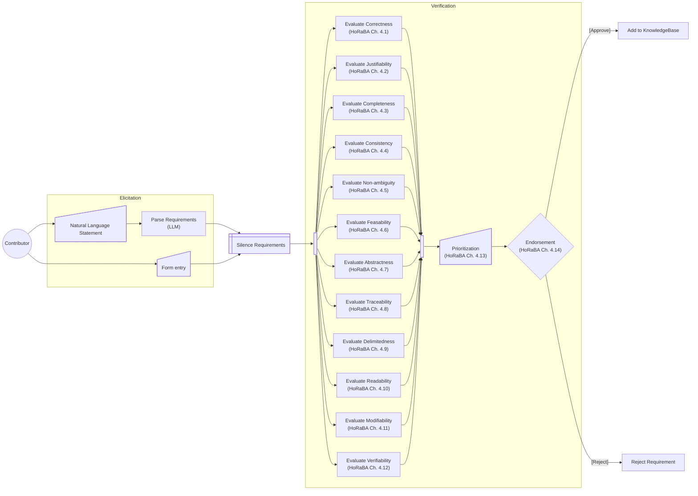

```mermaid
%% Doc: https://mermaid.js.org/syntax/flowchart.html
flowchart LR
    UserContrib@{ shape: circle, label: "Contributor" }
    SilenceReq@{ shape: win-pane, label: "Silence Requirements"}
    KB@{ shape: proc, label: "Add to KnowledgeBase" }
    RejReq@{ shape: proc, label: "Reject Requirement" }

    UserContrib --> NLInput
    UserContrib --> FormReq
    NLInput --> ParseReq
    ParseReq --> SilenceReq
    FormReq --> SilenceReq

    subgraph Elicitation
        FormReq@{ shape: manual-input, label: "Form entry" }
        NLInput@{ shape: manual-input, label: "Natural Language Statement" }
        ParseReq@{ shape: proc, label: "Parse Requirements<br>(LLM)"}
    end

    subgraph Verification
        ReqFork@{ shape: fork }

        Correctness@{ shape: proc, label: "Evaluate Correctness\n(HoRaBA Ch. 4.1)"}
        Justifiability@{ shape: proc, label: "Evaluate Justifiability\n(HoRaBA Ch. 4.2)" }
        Completeness@{ shape: proc, label: "Evaluate Completeness\n(HoRaBA Ch. 4.3)"}
        Consistency@{ shape: proc, label: "Evaluate Consistency\n(HoRaBA Ch. 4.4)"}
        NonAmbiguity@{ shape: proc, label: "Evaluate Non-ambiguity\n(HoRaBA Ch. 4.5)" }
        Feasability@{ shape: proc, label: "Evaluate Feasability\n(HoRaBA Ch. 4.6)" }
        Abstractness@{ shape: proc, label: "Evaluate Abstractness\n(HoRaBA Ch. 4.7)"}
        Traceability@{ shape: proc, label: "Evaluate Traceability\n(HoRaBA Ch. 4.8)"}
        Delimitedness@{ shape: proc, label: "Evaluate Delimitedness\n(HoRaBA Ch. 4.9)"}
        Readability@{ shape: proc, label: "Evaluate Readability\n(HoRaBA Ch. 4.10)" }
        Modifiable@{ shape: proc, label: "Evaluate Modifiability\n(HoRaBA Ch. 4.11)" }
        Verifiability@{ shape: proc, label: "Evaluate Verifiability\n(HoRaBA Ch. 4.12)" }
        ReqJoin@{ shape: join }
        Prioritization@{ shape: manual-input, label: "Prioritization\n(HoRaBA Ch. 4.13)" }
        Endorsement@{ shape: decision, label: "Endorsement\n(HoRaBA Ch. 4.14)"}
    end
    SilenceReq --> ReqFork

    ReqFork --> Correctness --> ReqJoin
    ReqFork --> Justifiability --> ReqJoin
    ReqFork --> Completeness --> ReqJoin
    ReqFork --> Consistency --> ReqJoin
    ReqFork --> NonAmbiguity --> ReqJoin
    ReqFork --> Feasability --> ReqJoin
    ReqFork --> Abstractness --> ReqJoin
    ReqFork --> Traceability --> ReqJoin
    ReqFork --> Delimitedness --> ReqJoin
    ReqFork --> Readability --> ReqJoin
    ReqFork --> Modifiable --> ReqJoin
    ReqFork --> Verifiability --> ReqJoin

    ReqJoin --> Prioritization --> Endorsement

    Endorsement --[Approve]--> KB
    Endorsement--[Reject]--> RejReq
```